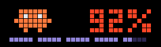

# ClaudeCodeMonitor

<p align="center"></p>

See how much of your Claude Code allowance you have used, on a pixel clock on your desk.

A small Windows program checks your usage every 2 minutes and shows it on a Ulanzi TC001 clock. It uses the login Claude Code already has on your PC, and checking usage costs no tokens and no money.

## What you need

- A **Ulanzi TC001** pixel clock with the free [AWTRIX3](https://blueforcer.github.io/awtrix3/) firmware installed (their site has a one-click web installer)
- A **Windows PC** with [Claude Code](https://claude.com/claude-code) installed and logged in
- The [.NET 10 SDK](https://dotnet.microsoft.com/download) (only needed to build the program)

## Get started

**1. Find your clock's IP address.** It scrolls across the clock when it starts up, and it is also shown in the AWTRIX web page. It looks like `192.168.1.42`.

**2. Download this repo** and open a terminal in its folder.

**3. Tell the program where your clock is.** Create a file called `appsettings.Local.json` in the repo folder with this content (use your own clock's address):

```json
{
  "Monitor": {
    "AwtrixHost": "192.168.1.42"
  }
}
```

**4. Run it:**

```powershell
dotnet run
```

That's it. Within a few seconds Clawd shows up on your clock with your usage next to him.

Don't have a clock yet? You can [try it in your browser](#testing-without-the-clock) first.

### Make it start by itself

Build a standalone copy, then tell Windows to start it when you log in:

```powershell
dotnet publish -c Release -r win-x64 --self-contained -o publish
schtasks /Create /TN "ClaudeCodeMonitor" /TR "$PWD\publish\ClaudeCodeMonitor.exe" /SC ONLOGON /RL LIMITED /F
```

The program runs silently in the background with no window. Your `appsettings.Local.json` is copied into the `publish` folder automatically.

Prefer not to use Task Scheduler? Press `Win+R`, run `shell:startup`, and drop in a shortcut to `publish\ClaudeCodeMonitor.exe`. Set the shortcut's "Start in" folder to the `publish` folder so the settings files are found.

## What you see

**Session screen** (the home screen) — Clawd next to the percent of your 5-hour session allowance you have used. The purple bar along the bottom shows how much of the 5 hours has passed, one segment per hour.

**Weekly screen** — your 7-day usage, with a bar of seven segments showing how far into the week you are. It appears for 5 seconds every 10 minutes, then the session screen comes back. The clock's left/right buttons still work, and the program never fights them.

<p align="center"></p>

Clawd has moods:

| | |
|---|---|
|  | **Idle** — walks and blinks |
|  | **Panic** — past 90% used, the number turns red and Clawd gets jittery |
|  | **Sad** — at 100% used: sad blue eyes and a rolling tear |
|  | **Celebration** — your allowance just reset! Clawd dances under confetti for a minute and the clock's buzzer plays a fanfare (can be [turned off](#settings)) |
|  | **Issue** — fresh data can't be fetched, so the last known values are shown in grey with an orange `!`. Grey never reads as real data |

If the program stops, its screens disappear from the clock by themselves within a few minutes, leaving a clean clock face.

## Troubleshooting

- **Grey screen with an orange `!`** — the program is running but can't get fresh data. Usually Claude Code isn't logged in or its login expired; just use Claude Code again and it fixes itself.
- **Screens disappeared from the clock** — the program isn't running. Start it and they reappear.
- **`Clock unreachable` warnings** — check the address in `appsettings.Local.json` and that the clock is on your network. No restart needed; it keeps retrying.
- **Want to see what it's doing?** — run `dotnet run` in a terminal; all activity is logged there. Tokens and credentials are never logged.

## Settings

All optional except `AwtrixHost`. Put them in `appsettings.Local.json` (git-ignored, so your network details stay out of the repo) or `appsettings.json`. The local file wins, and environment variables such as `Monitor__AwtrixHost` win over both.

| Setting | Default | Description |
|---|---|---|
| `Monitor:AwtrixHost` | *(required)* | Clock IP or hostname, e.g. `192.168.1.42` |
| `Monitor:PollIntervalMinutes` | `2` | Minutes between usage checks |
| `Monitor:StaleAfterFailures` | `3` | Failed checks in a row before the issue screen |
| `Monitor:CelebrationSeconds` | `60` | How long the reset confetti plays |
| `Monitor:CelebrationSound` | `true` | Play a jingle on the clock's buzzer when a window resets; `false` for a silent celebration |
| `Monitor:CelebrationMelody` | *(fanfare)* | The jingle, in [RTTTL](https://en.wikipedia.org/wiki/Ring_Tone_Text_Transfer_Language) ringtone format |
| `Monitor:WeekPeekIntervalMinutes` | `10` | Minutes between brief looks at the weekly screen; `0` disables |
| `Monitor:WeekPeekSeconds` | `5` | How long each weekly peek lasts |
| `Monitor:CredentialsPath` | `%USERPROFILE%\.claude\.credentials.json` | Claude Code credentials file |
| `Monitor:UsageBaseUrl` | `https://api.anthropic.com` | Usage endpoint base URL (override for testing) |

## Testing without the clock

`tools/AwtrixSimulator` is a small local web app that pretends to be the clock and draws the 32×8 LED matrix in your browser, including the animations, the buzzer melody, and ◀ ▶ buttons (or arrow keys) to switch screens.

```powershell
# Terminal 1 — the simulator (listens on localhost:8090)
dotnet run --project tools\AwtrixSimulator

# Terminal 2 — the monitor, pointed at the simulator without touching your settings files
$env:Monitor__AwtrixHost = "localhost:8090"
dotnet run
```

Then open http://localhost:8090 to watch the screens.

The simulator also serves a **fake usage endpoint**, so you can preview any state without touching your real allowance:

```powershell
# Terminal 2 — monitor using fake data
$env:Monitor__AwtrixHost = "localhost:8090"
$env:Monitor__UsageBaseUrl = "http://localhost:8090"
dotnet run
```

Use the **scenario buttons** on the simulator page (LIVE / Normal / Panic / Sad / Refill celebration / Outage) to stage each state with one click. LIVE passes your real usage data through, so you can hop between real and simulated states without restarting anything. You can also set exact numbers yourself:

```powershell
Invoke-RestMethod -Method Post -Uri http://localhost:8090/fake-usage -ContentType "application/json" `
  -Body '{"session":100,"weekly":15,"sessionResetsInSeconds":6000,"weeklyResetsInSeconds":400000}'
```

## Clock power follows the PC

Optional: `tools/power/Register-PowerTasks.ps1` registers two scheduled tasks so the clock's display turns off when your PC sleeps or shuts down, and back on when you log in or wake it:

- `ClaudeCodeMonitor-PowerOn` — at logon or resume from sleep (event 107), turns the matrix on (retries ~1 min while Wi‑Fi connects)
- `ClaudeCodeMonitor-PowerOff` — on shutdown/restart initiated (event 1074) or entering sleep (event 42), turns it off

Manual: `tools/power/Set-AwtrixPower.ps1 -State On|Off`. Remove: `Unregister-ScheduledTask ClaudeCodeMonitor-PowerOn,ClaudeCodeMonitor-PowerOff`.

## How it works

The program is the only smart part; the clock is just a display. Each check it reads `%USERPROFILE%\.claude\.credentials.json` (read-only, never written), calls `GET https://api.anthropic.com/api/oauth/usage` with the token, and POSTs small icon+draw payloads to the clock's `/api/custom` endpoint. Clawd is a set of GIF icons uploaded to the clock at startup, so the clock animates him itself between data pushes; the celebration is the one time the program streams animation frames.

Your token is only ever sent to Anthropic. Nothing sensitive is logged or sent to the clock. Failures degrade gracefully: short hiccups keep the last data, and a 429 pauses checks for as long as `Retry-After` asks.

The `api/oauth/usage` endpoint is undocumented and may change without notice. The program parses it tolerantly (unknown fields ignored, missing windows treated as 0%) and falls back to the issue screen rather than crashing. It is called at most once per cycle — be a courteous consumer.

The images in this README are rendered from the monitor's own drawing code, so they match the clock pixel for pixel. Regenerate them with `dotnet run --project tools\ScreenshotGenerator`.

## Disclaimer

An unofficial hobby project, not affiliated with or endorsed by Anthropic. Claude and Clawd belong to Anthropic, AWTRIX3 is by Blueforcer, and the TC001 is made by Ulanzi.
